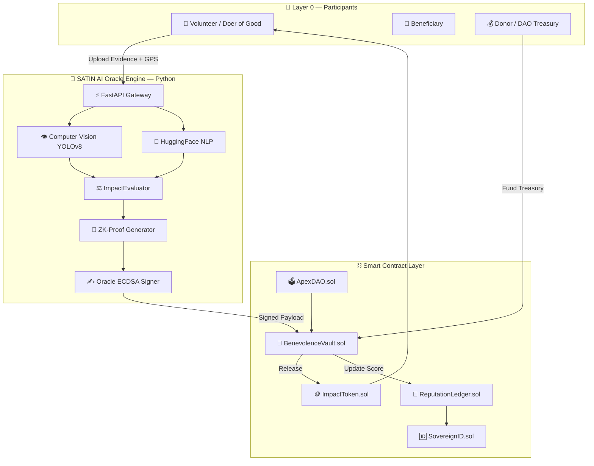
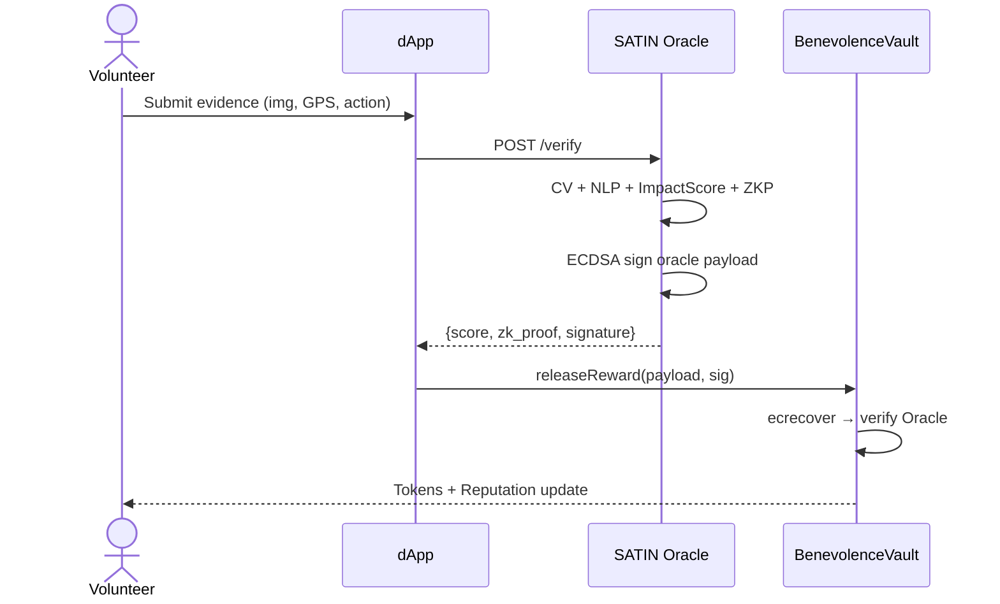

# APEX HUMANITY — System Architecture Blueprint

## High-Level Architecture Diagram



## Oracle to Contract Sequence



## Impact Score Formula

```
ImpactScore = (Urgency×0.35) + (Difficulty×0.25) + (Reach×0.20) + (Authenticity×0.20)
TokenReward = BaseReward × (ImpactScore/100) × LocationMultiplier
```
