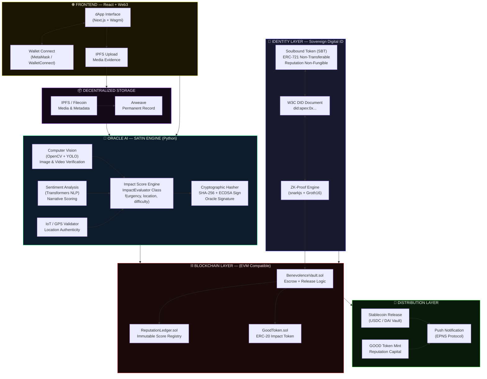
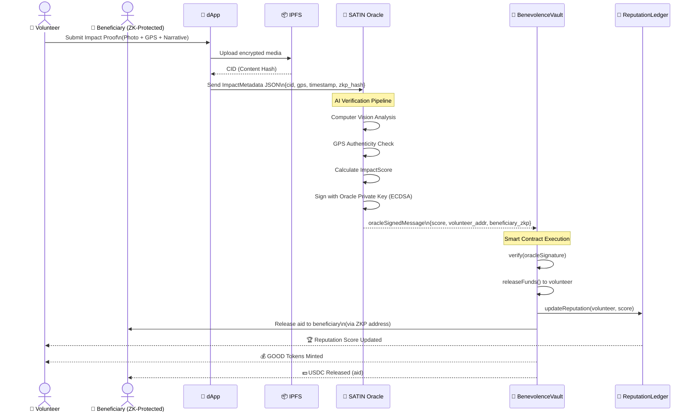

# APEX HUMANITY — Sovereign Benevolence Protocol
## High-Level Architecture (v1.0)



## Data Flow — Proof of Beneficial Action (PoBA)



## Impact Score Formula

```
ImpactScore = (BaseScore × UrgencyMultiplier × LocationMultiplier × DifficultyMultiplier) / NormalizationFactor

Where:
- BaseScore          = AI confidence (0.0 – 1.0) × 100
- UrgencyMultiplier  = {CRITICAL: 3.0, HIGH: 2.0, MEDIUM: 1.5, LOW: 1.0}
- LocationMultiplier = 1 + (poverty_index × 0.5)   [UN HDI poverty index]
- DifficultyMultiplier = 1 + (effort_hours × 0.1)
- NormalizationFactor  = 10 (to keep scores in 0–100 range)
```

## Technology Stack

| Layer | Technology |
|-------|-----------|
| Smart Contracts | Solidity 0.8.x, Hardhat, OpenZeppelin |
| ZK Proofs | snarkjs, Circom, Groth16 |
| AI Oracle | Python 3.11, OpenCV, HuggingFace Transformers, FastAPI |
| Blockchain | EVM (Polygon / Ethereum L2) |
| Frontend | Next.js 14, Wagmi v2, RainbowKit, TailwindCSS |
| Storage | IPFS (web3.storage), Arweave |
| Database (Off-chain) | PostgreSQL + Redis (oracle cache) |
| Messaging | The Graph Protocol (indexing), EPNS (notifications) |
